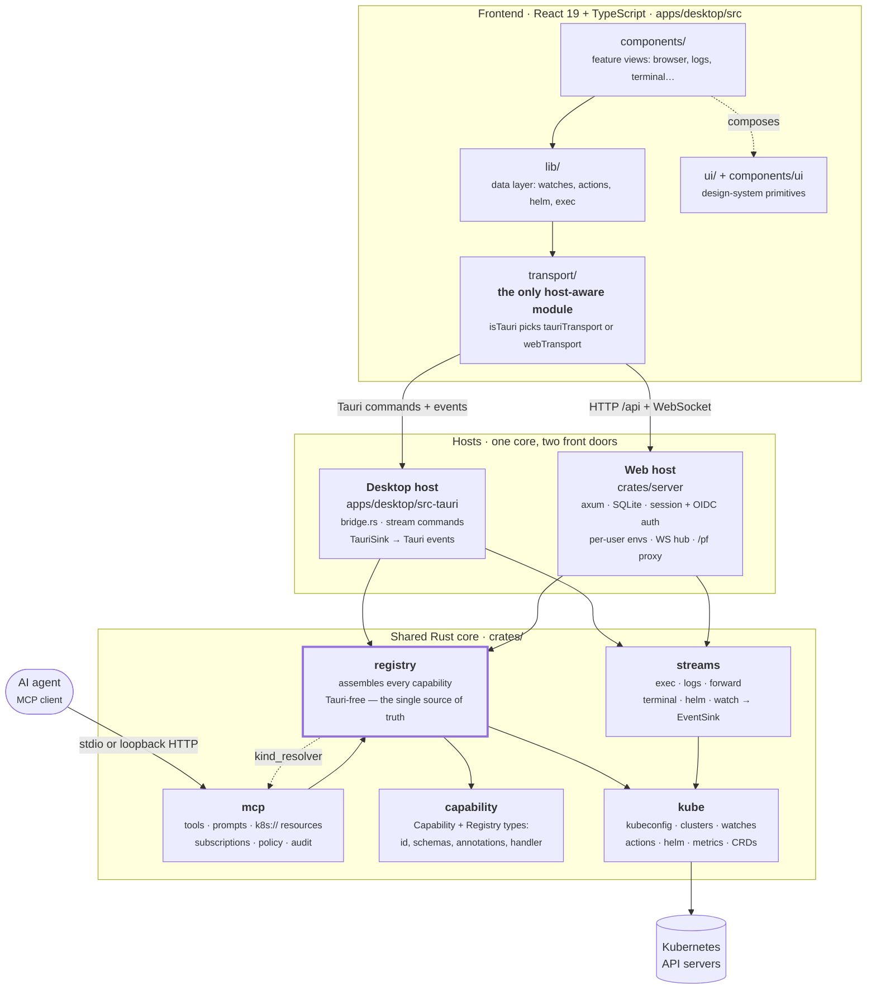

# Developer guide

This guide covers everything you need to build, test, and extend srelens.

## Prerequisites

- **Rust** (stable) — install via [rustup](https://rustup.rs). The toolchain is pinned by `rust-toolchain.toml` (stable + `llvm-tools-preview` for coverage).
- **Node.js 22+** and **pnpm 9+**.
- **Tauri v2 system dependencies** — see the [official prerequisites](https://v2.tauri.app/start/prerequisites/) (on macOS: Xcode command-line tools; on Linux: webkit2gtk and friends).
- A kubeconfig with at least one reachable cluster ([kind](https://kind.sigs.k8s.io) or k3d works well for development).
- **Docker** — only if you want to build or run the [web app](#web-mode) locally.

## Getting started

```sh
pnpm install       # installs all workspace JS dependencies
pnpm dev           # runs `tauri dev`: Vite dev server + Rust backend with hot reload
```

The first `pnpm dev` compiles the full Rust dependency tree and takes a few minutes; subsequent runs are incremental.

> **Note:** Cargo build caches embed absolute paths. If you move or rename the repository directory, run `cargo clean` before building again.

### Everyday commands

| Command | What it does |
| --- | --- |
| `pnpm dev` | Launch the desktop app in dev mode |
| `pnpm test` | All JS/TS tests via Vitest, with coverage |
| `pnpm --filter @srelens/desktop test:watch` | Vitest in watch mode |
| `cargo test` | All Rust tests across the workspace |
| `cargo llvm-cov --workspace --summary-only` | Rust tests with a coverage report |
| `pnpm build` | Production frontend build (`vite build`) |
| `pnpm tauri build` | Packaged, installable desktop binaries |
| `pnpm tauri icon apps/desktop/src-tauri/icons/icon.svg` | Regenerate the full app icon set from the source SVG |
| `UPDATE_CATALOG=1 cargo test -p srelens-registry` | Regenerate the committed capability catalog after adding a capability |

Live-cluster suites are `#[ignore]`d and need an explicit run — see [Testing standards](#testing-standards).

## Architecture

srelens builds **two hosts on one shared core**. The desktop app (Tauri) and the
headless web server (axum) both assemble the *same* capability registry and drive
the *same* streaming cores; they differ only in how they reach the user — Tauri
commands and events versus HTTP and WebSocket frames.



The two hosts differ only in how they reach the user. Everything below `crates/registry` is shared, and `crates/registry` is deliberately Tauri-free so the headless server binary builds the identical capability set.

### The crates

| Crate | Role |
| --- | --- |
| `crates/capability` | The `Capability` type itself: id, JSON schemas, safety annotations, async handler, and the `Registry` that holds them. No Kubernetes knowledge. |
| `crates/kube` | Everything Kubernetes: kubeconfig discovery and merging, client cache, auth/OIDC resolution, watches, per-resource modules, actions, Helm, metrics, CRDs, toolbox. |
| `crates/streams` | Host-agnostic streaming cores (exec, logs, forward, terminal, helm, watch). Each manager drives a `crates/kube` stream — or, for `terminal` and `helm`, a local PTY/CLI subprocess — and emits into an `EventSink` the host implements: Tauri events on desktop, WebSocket frames on the web. |
| `crates/registry` | **Where capabilities are registered.** Tauri-free on purpose, so the headless server binary builds the identical registry without linking Tauri. Also owns the catalog projection and the MCP `KindResolver`. |
| `crates/mcp` | The MCP server: tools generated from the registry, plus prompts, `k8s://` resources, watch-backed subscriptions, consent policy, token auth, and the audit log. Transports: stdio and loopback HTTP. |
| `crates/server` | The web host: axum router, SQLite (sqlx) store, session + OIDC auth, per-user isolated environments, encrypted kubeconfigs and cluster tokens, WebSocket hub, port-forward proxy. Ships as the `srelens-server` binary. |
| `apps/desktop/src-tauri` | The Tauri shell: window, command bridge, stream commands, updater, settings, MCP wiring. Its `capabilities.rs` is a thin re-export of `crates/registry`. |

### The capability registry (core pattern)

Every backend operation is a `Capability` (`crates/capability`): an id (e.g. `k8s.listPods`), JSON input/output schemas, safety annotations (`read_only`, `destructive`, `requires_confirm`, `sensitive`), and an async handler.

**`crates/registry/src/lib.rs` is the single place capabilities are registered.** It is deliberately Tauri-free: `build_registry()` / `build_registry_with_paths()` produce the same registry for the desktop app and for the headless `srelens-server` binary. `apps/desktop/src-tauri/src/capabilities.rs` only re-exports it.

One registration produces three surfaces:

1. **Tauri** — the UI calls `invoke_capability(id, payload)` through the transport shim.
2. **Web** — the same id is reachable over `/api` in `crates/server`.
3. **MCP** — `crates/mcp` turns each capability into an MCP tool with the same schema.

Four invariants are enforced by tests rather than by review, so "everything is exposed, and nothing mutates without consent" is a build failure when broken:

| Test | Guarantee |
| --- | --- |
| `every_capability_is_mcp_exposed` (`crates/registry`) | The registry and the MCP tool list match exactly. |
| `assert_mutating_capabilities_are_gated` (`crates/mcp/src/completeness.rs`) | Every capability that is not `read_only` is `requires_confirm`. Note the predicate is *mutating*, not *destructive* — a non-destructive capability can still need consent. |
| `capability_catalog_json_is_in_sync` (`crates/registry`) | The committed `apps/desktop/src/lib/capability-catalog.json` equals the live registry, so the frontend palette audit can cross-check without linking Rust. Regenerate with `UPDATE_CATALOG=1 cargo test -p srelens-registry`. |
| `full_capability_suite` (`apps/desktop/src-tauri/tests/e2e.rs`) | Every registered capability is actually exercised against a live kind cluster, or explicitly excluded with a reason. Runs in the `integration` CI job. |

### Long-lived streams

Watches, pod exec, log tails, terminals, helm operations, and port-forwards don't fit request/response. Their logic lives in `crates/streams`, one manager per stream kind, each emitting into an `EventSink`:

- **Desktop** implements `EventSink` over Tauri events (`apps/desktop/src-tauri/src/sink.rs`); the streams are started by dedicated Tauri commands (`start_resource_watch`, `start_pod_exec`, `start_log_stream`, `start_port_forward`, plus matching stop/input commands).
- **Web** implements it over WebSocket frames (`crates/server/src/ws/`, `crates/server/src/streams.rs`), started through `/api/command/*`.

The frontend side is identical in both cases and lives in `apps/desktop/src/lib/` (`watch.ts`, `exec.ts`, `logsStream.ts`, `forward.ts`).

### The transport shim

`apps/desktop/src/transport/` is the only frontend code that knows which host it is running in. `transport.ts` picks `tauriTransport` or `webTransport` at load time based on `isTauri()`, and re-exports one interface (`invokeCapability`, `invokeCommand`, `on`, `subscribe`, …). Everything else — stores, components, tests — depends only on that interface. This is what makes the UI testable in jsdom *and* what makes web mode possible at all, so keep `@tauri-apps/api` imports confined to `src/transport/`.

### Running the MCP server

```sh
cargo run -p srelens-desktop --no-default-features -- --mcp-stdio
cargo run -p srelens-desktop --no-default-features -- --mcp-http 127.0.0.1:8765
```

The HTTP transport binds to loopback, requires a bearer token (`crates/mcp/src/auth.rs`, supplied via `SRELENS_MCP_TOKEN` — never a flag, since argv is readable via `ps`), and checks the `Host` header on every route to block DNS rebinding. Gated tools go through an injected `ConfirmPolicy` (`crates/mcp/src/policy.rs`), which receives a `ConsentKind` derived from the capability's annotations: a gated capability that is `read_only` is a `SensitiveRead`, anything else gated is `Destructive`. The desktop app prompts in-app for both; headless runs need `"_confirm": true` on the call plus the matching flag (`--mcp-allow-destructive` or `--mcp-allow-sensitive-reads`) — `_confirm` alone never authorizes anything, and neither flag implies the other.

Beyond tools, the server implements:

- **Prompts** (`crates/mcp/src/prompts.rs`) — canned diagnostic flows, with bodies in `crates/mcp/src/prompts/*.md` as `discover`/`targeted` pairs (pod-crashloop, pod-pending, node-pressure, service-no-endpoints), plus user-authored prompts from a host-supplied directory. A test asserts every tool a prompt names really exists and is on the read-only allowlist.
- **Resources** (`crates/mcp/src/resources.rs`) — `k8s://` URIs resolved through a `KindResolver`. Secrets are deliberately *not* addressable as resources; they stay behind the gated `k8s.getSecret` tool, which is what keeps "the consent gate never fires on a resource read" true.
- **Subscriptions** (`crates/mcp/src/subscriptions.rs`) — watch-backed `resources/subscribe`. Server→client push currently works on stdio; HTTP push is tracked as future work.

Every component fails closed: an `McpServer` whose host wires nothing denies every gated call, resolves no kinds, and refuses every subscription.

See [MCP.md](MCP.md) for the full security model.

## Web mode

srelens also runs as a multi-user web server in a container — same registry, same
streams, different host. `crates/server` owns it, and it ships as its own binary.

```sh
# run the server against the built frontend
pnpm build
SRELENS_DEV_LOGIN=you@example.com \
SRELENS_MASTER_KEY=$(openssl rand -hex 32) \
cargo run -p srelens-server --bin srelens-server -- serve 127.0.0.1:8080 --data ./srelens-data

# or build and run the shipped image
docker compose up --build
```

The frontend is embedded into the binary with `rust-embed`, so `pnpm build` must
run before the server crate is compiled for release.

Things worth knowing before you touch this crate:

- **The server refuses to start without `SRELENS_MASTER_KEY`**, and without either OIDC config or `SRELENS_DEV_LOGIN`. Both are deliberate fail-closed checks, not conveniences.
- **Every user gets an isolated environment** — their own sealed kubeconfigs, their own materialized files under `$SRELENS_DATA/runtime` (tmpfs in production), their own helm home. Anything you add that touches per-user state goes through `users::UserEnvs`, never a process-wide path.
- **Some capabilities are refused on the web surface**: host shell, toolbox installs, and helm `repo`/`plugin` operations, because on a shared container they would run as the shared UID or leak across users. Denials are enforced at *both* layers, never in the UI alone — `WEB_DENIED_CAPABILITIES` in `crates/server/src/api.rs` for the capability surface, and `WEB_DENIED_COMMANDS` / `HELM_DENIED_SUBCOMMANDS` in `crates/server/src/api_command.rs` for the streaming surface.
- **Web mode is single-instance.** SQLite, in-memory OIDC login state, live WebSockets, and port-forwards are all per-process; a second replica breaks logins and streams and risks database corruption.
- OIDC HTTP clients disable redirect following on purpose — the issuer URL can come from a user's kubeconfig, and a redirect-following client turns discovery into an SSRF primitive.

See [docs/WEB.md](WEB.md) for deployment, environment variables, cluster OIDC sign-in, and the full security model.

## Testing standards

Development is **test-driven — this is mandatory, not aspirational**:

1. Write a failing test that motivates the change (red).
2. Make it pass with the simplest implementation (green).
3. Refactor with the tests as a safety net.

**Coverage floors, enforced in CI:**

- TypeScript: **80% lines** (Vitest `thresholds` in `apps/desktop/vitest.config.ts`). Ratcheting toward 85 — see issue #28. `src/main.tsx`, the test setup, and `PodTerminal.tsx` (xterm DOM integration, verified live) are excluded.
- Rust: **55% lines, ratcheting toward 85** — the Tauri runtime shell is excluded from measurement via `--ignore-filename-regex`, and much of `crates/kube` needs a live cluster to exercise; the floor rises as cluster-bound integration tests land.

Never lower either floor.

Test placement conventions:

- Rust: unit tests in `#[cfg(test)]` modules next to the code.
- TypeScript: `Foo.test.tsx` / `foo.test.ts` beside `Foo.tsx` / `foo.ts`. Component tests use Testing Library against the transport shim (mocked), not Tauri.

### Live-cluster tests

Suites that need a real cluster are `#[ignore]`d so a plain `cargo test` stays fast and offline. Run them explicitly against a kind cluster:

```sh
kind create cluster --name srelens-e2e
export SRELENS_E2E_CONTEXT=kind-srelens-e2e
cargo test -p srelens-desktop --test e2e -- --ignored --nocapture --test-threads=1
cargo test -p srelens-kube --test helm_lifecycle -- --ignored --nocapture --test-threads=1
```

The e2e suite prints `covered N/M capabilities` and fails if any registered capability is neither exercised nor explicitly excluded with a reason — so a new capability cannot land with no end-to-end case.

## Adding a new capability (walkthrough)

1. **Write the handler test-first** in the right `crates/kube` module (or a new one): a `pub fn <name>_capability(cache: …) -> Capability` returning schemas derived with `schemars` and an async handler.
2. **Register it** in `crates/registry/src/lib.rs` — the Tauri, web, and MCP surfaces all appear automatically.
3. **Annotate safety** — mark it `read_only`, or `requires_confirm` (plus `destructive`/`sensitive` where they apply) so MCP hints and UI confirmations are driven from one place. A mutating capability that is not confirm-gated fails the build. (Web denial is *not* annotation-driven — see step 7.)
4. **Regenerate the catalog** — `UPDATE_CATALOG=1 cargo test -p srelens-registry`, and commit the updated `apps/desktop/src/lib/capability-catalog.json`.
5. **Add an e2e case** in `apps/desktop/src-tauri/tests/e2e.rs`, or exclude it there with an explicit reason.
6. **Consume it in the UI** — call it through the data layer in `apps/desktop/src/lib/`, never directly from a component.
7. **Consider web mode** — if the capability cannot be safe on a shared multi-user container, add it to `WEB_DENIED_CAPABILITIES` in `crates/server/src/api.rs`.
8. Run `cargo test && pnpm test` and check coverage before opening a PR.

## Continuous integration

`.github/workflows/ci.yml` runs three jobs on every push and PR to `dev` or `main`:

- **frontend** — `pnpm build` + Vitest with the coverage threshold.
- **backend** — `cargo llvm-cov` with the ratcheting coverage floor (see above).
- **integration (kind)** — spins up a kind cluster and helm, then runs the `#[ignore]`d live-cluster suites: the full capability e2e suite (which enforces capability coverage) and the helm lifecycle suite. Without this job a new capability could land with no end-to-end case.

All three must be green.

A separate Release workflow (`.github/workflows/release.yml`) publishes on pushes to `main` — Conventional-Commit-driven stable releases. Rolling `dev` pre-releases are **not** cut on every push: they come from a daily 18:00 UTC cron, or on demand via *Run workflow*. AUR publishing is split into `.github/workflows/aur-publish.yml` so it can also be run by hand.

## Conventions

- **Branching** — `dev` is the default branch; open PRs against it. `main` carries stable releases.
- **Commits** — imperative subject line, body explaining *why* when non-obvious. Stable releases are Conventional-Commit-driven, so use `feat(scope):` / `fix(scope):` prefixes.
- **Formatting** — `cargo fmt` for Rust; the existing Prettier-ish style for TS (match surrounding code).
- **UI** — primitives come from `src/components/ui` (shadcn/radix) and `src/ui`; feature views compose them. Styling lives in `src/ui/styles.css` design tokens — avoid ad-hoc inline styles.
- **No direct Tauri imports** outside `src/transport/`.
- **No host-specific logic in `crates/`** — if a change only makes sense for the desktop or only for the web, it belongs in `apps/desktop/src-tauri` or `crates/server`, not in the shared core.
