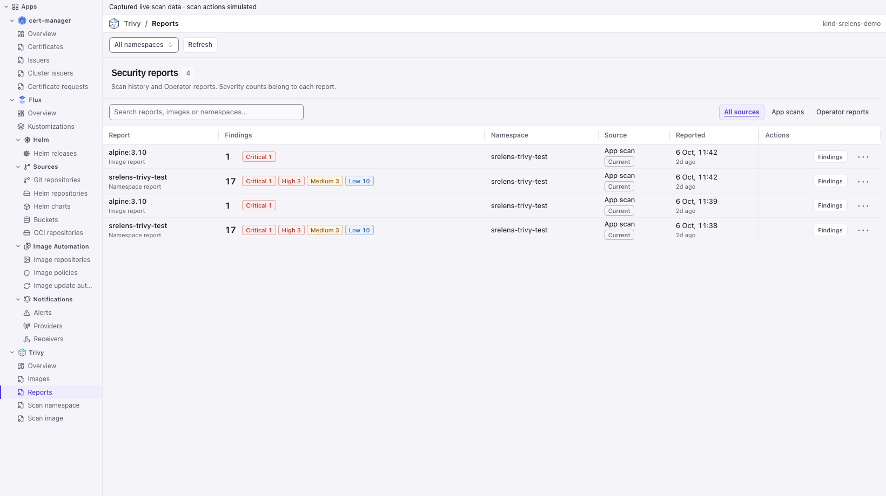
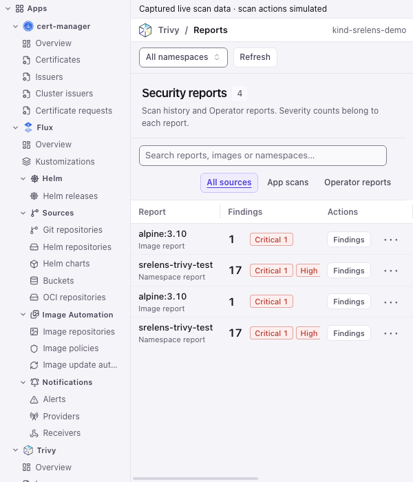

# Native executable app UI evidence

Captured on the PR branch after merging the current `dev`. These are the real
native components with captured local demo scan results. The banner identifies
simulated scan actions; these screenshots do not claim a new live scan.

The browser check exercised an explicit namespace scan launch and completed
status, report source filters, report metadata actions, and navigation to
Findings. Synthetic Operator rows additionally verified that resource identity
and `criticalCount`/`highCount` severities remain visible.

## Wide reports pane

## Narrow reports pane

