<p align="center">
  
</p>

<h3 align="center">Die Kommandozentrale für Kubernetes – in Rust gebaut, bereit für Engineers und KI-Agenten.</h3>

<p align="center">
  <a href="../../README.md">English</a> ·
  <a href="README.zh-CN.md">简体中文</a> ·
  <a href="README.ja.md">日本語</a> ·
  <a href="README.ko.md">한국어</a> ·
  <a href="README.es.md">Español</a> ·
  <a href="README.pt-BR.md">Português</a> ·
  <b>Deutsch</b> ·
  <a href="README.fr.md">Français</a>
</p>

<p align="center"><i>Dies ist eine Übersetzung. Maßgeblich ist die <a href="../../README.md">englische README</a>; wenn sich beide unterscheiden, gilt die englische Fassung.</i></p>

<p align="center">
  srelens ist ein quelloffener Local-first-Workspace für Kubernetes, gedacht für SREs,
  Platform-Engineers und DevOps-Engineers. Untersuche, analysiere und greife sicher ein,
  über mehrere Cluster hinweg – in der <b>Desktop-App</b>, in der <b>Terminal-UI</b> oder über einen
  <b>MCP-Server</b>, den dein KI-Agent aufrufen kann. Ein gemeinsamer Kern in reinem Rust treibt alle drei an.
</p>

<p align="center">
  <a href="https://srelens.com">Website</a> ·
  <a href="#installation">Installation</a> ·
  <a href="#desktop-app">Desktop-App</a> ·
  <a href="#terminal-ui-srectl">Terminal-UI</a> ·
  <a href="#mcp-server">MCP-Server</a> ·
  <a href="../USAGE.md">Benutzerhandbuch</a> ·
  <a href="../DEVELOPMENT.md">Entwicklerhandbuch</a> ·
  <a href="../../CONTRIBUTING.md">Mitwirken</a>
</p>

<p align="center">
  <a href="https://github.com/srelens/srelens/stargazers"></a>
  <a href="https://www.reddit.com/r/srelens/"></a>
  <a href="https://deepwiki.com/srelens/srelens"></a>
</p>

<p align="center">
  <a href="https://github.com/srelens/srelens/releases/latest"></a>
  <a href="https://github.com/srelens/srelens/releases"></a>
  <a href="https://aur.archlinux.org/packages/srelens-bin"></a>
  <a href="../../LICENSE"></a>
  <a href="https://github.com/srelens/srelens/actions/workflows/ci.yml"></a>
  <a href="https://scorecard.dev/viewer/?uri=github.com/srelens/srelens"></a>
</p>

<p align="center">
  
  
  
  
  
</p>

<p align="center">
  <picture>
    <source media="(prefers-color-scheme: light)" srcset="../assets/screenshots/gui-overview-light.webp">
    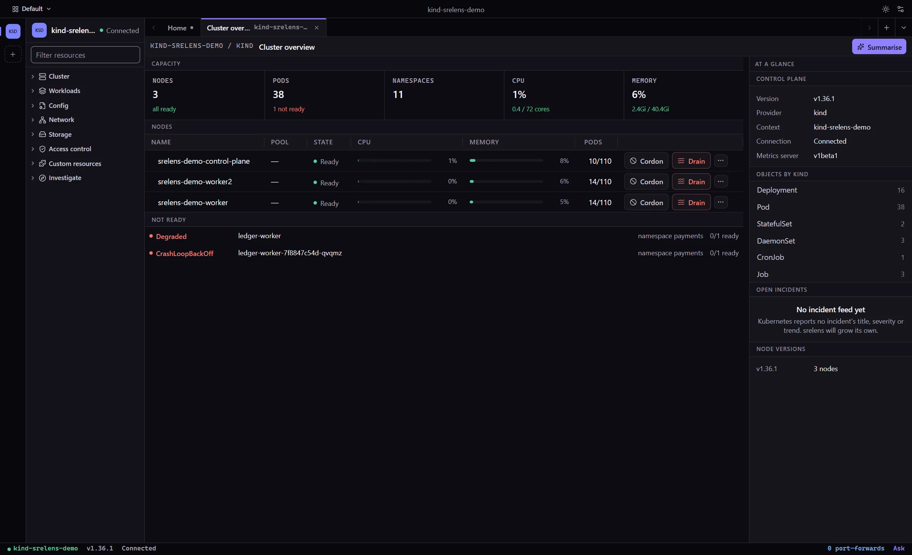
  </picture>
</p>

---

## Wähle deine Oberfläche

|  | Desktop-App (GUI) | Terminal-UI (`srectl`) |
| --- | --- | --- |
| **Was es ist** | Ein natives Fenster, gebaut mit Tauri v2 und React 19 | Ein einziges, eigenständiges Binary, gebaut mit ratatui |
| **Ideal für** | Tägliche Cluster-Arbeit, YAML-Bearbeitung, Topologie, viele Cluster nebeneinander | SSH-Sitzungen, Jump-Hosts, reine Tastaturbedienung, k9s-Muskelgedächtnis |
| **Läuft auf** | macOS, Linux, Windows – oder im Browser über den [Web-Modus](../WEB.md) | Linux (glibc und statisches musl) und macOS auf x86-64 und arm64; Windows auf x86-64 |
| **Installation** | [Release herunterladen](#installation) | `brew install srelens/tap/srectl` oder [per Einzeiler](#installation) |
| **KI** | Integrierter Assistent, dazu der MCP-Server unter **Settings → MCP** (Einstellungen → MCP) | `:ai`-Assistent, dazu `srectl mcp` über stdio |

Beide sprechen direkt mit deinen Clustern, mit den Zugangsdaten aus deiner lokalen
kubeconfig. Nichts läuft über einen Cloud-Dienst von srelens.

## Warum srelens?

Kubernetes-Troubleshooting heißt meist: zwischen Terminals, Dashboards,
YAML-Editoren, Logs und Cluster-Kontexten hin- und herspringen. srelens bündelt
diesen Untersuchungsablauf in einem einzigen Local-first-Workspace.

- **Ein Workspace von der Untersuchung bis zur Aktion** – Ressourcen ansehen, Events
  und YAML lesen, Logs verfolgen, Shells öffnen, Port-Forwardings starten und Aktionen
  im Cluster ausführen, ohne das Tool zu wechseln.
- **Gebaut für Engineers und KI-Agenten** – die Backend-Funktionen, die du in der
  App nutzt, sind genau die, die der integrierte MCP-Server bereitstellt.
- **Local-first-Clusterzugriff** – srelens verbindet sich direkt mit deinen
  API-Servern, mit den Zugangsdaten aus deiner eigenen kubeconfig.
- **Sichere Operationen** – destruktive Aktionen werden als solche erkannt und
  erfordern eine Bestätigung, in der App, im Terminal und über MCP.
- **Klein und schnell** – ein Rust-Kern auf der WebView des Betriebssystems. srelens
  `v0.5.0` wurde mit einem **17,1 MiB** großen macOS-Installer und einem **19,8 MiB**
  großen Linux-`.deb` ausgeliefert, gegenüber 190,2 MiB und 146,8 MiB bei Freelens
  `v1.10.3` – also rund **11- bzw. 7-mal kleiner**. Die
  [Performance-Baselines](../PERFORMANCE.md) zeigen, wie du das nachvollziehst,
  einschließlich der Fälle, in denen der Abstand geringer ausfällt.
- **Open Source** – MIT-lizenziert, mit öffentlichem Code, Releases, Issues und Roadmap.

## Desktop-App

Die Desktop-App ist ein vollständiger Kubernetes-Workspace in einem nativen
Fenster. Die Screenshots unten zeigen das **neue Design**, das Bildschirm für
Bildschirm eingeführt wird: Du schaltest es unter
**Settings → Appearance → Design → New design** (Einstellungen → Darstellung →
Design → Neues Design) ein und kannst jederzeit auf demselben Weg zurückwechseln.
Es gibt sechs Themes: Light, Paper, Dark, Midnight, Glass und High contrast.

<table>
  <tr>
    <td width="50%">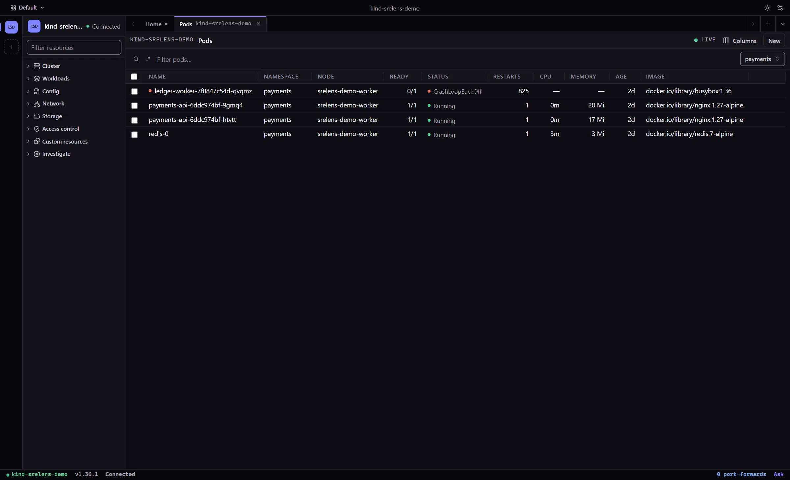<br><sub><b>Live-Ressourcen</b> – per Watch aktualisierte Tabellen mit Filtern, Spalten und Massenaktionen</sub></td>
    <td width="50%">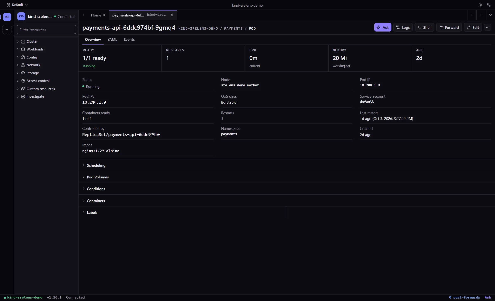<br><sub><b>Ressourcendetails</b> – Status, Events, Owner sowie Logs, Shell und Forwarding mit einem Klick</sub></td>
  </tr>
  <tr>
    <td>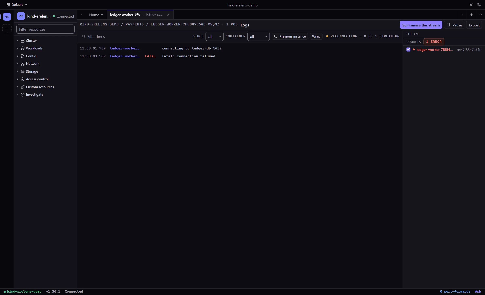<br><sub><b>Logs</b> – Streams über mehrere Pods, vorherige Instanz, Filter, Export und KI-Zusammenfassungen</sub></td>
    <td>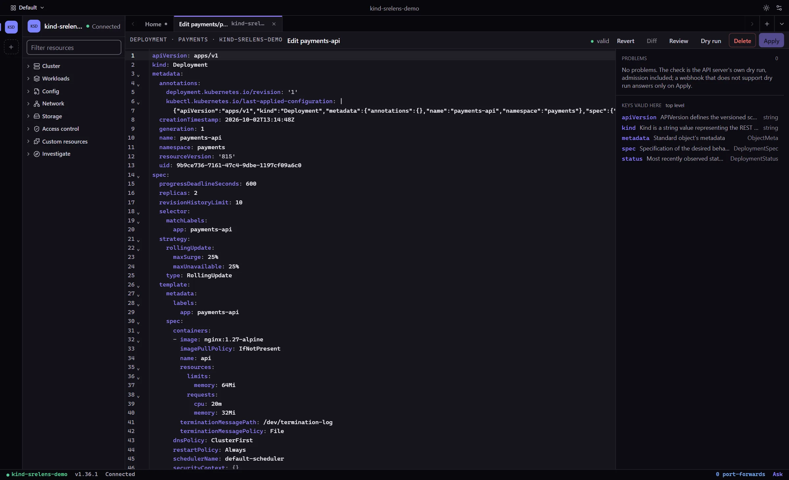<br><sub><b>YAML</b> – schemabewusstes Editieren, serverseitiger Dry Run, Diff und Server-Side Apply</sub></td>
  </tr>
  <tr>
    <td>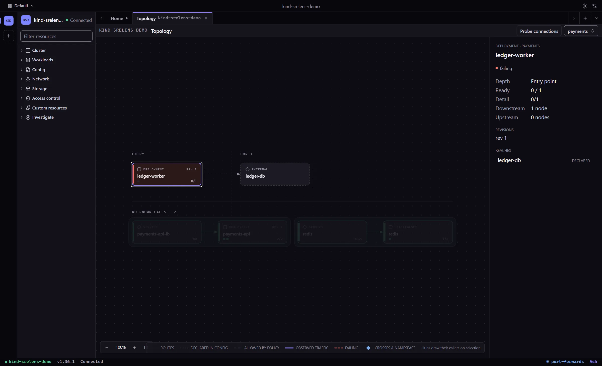<br><sub><b>Topologie</b> – wer wen aufruft und wo der Fehler beginnt</sub></td>
    <td>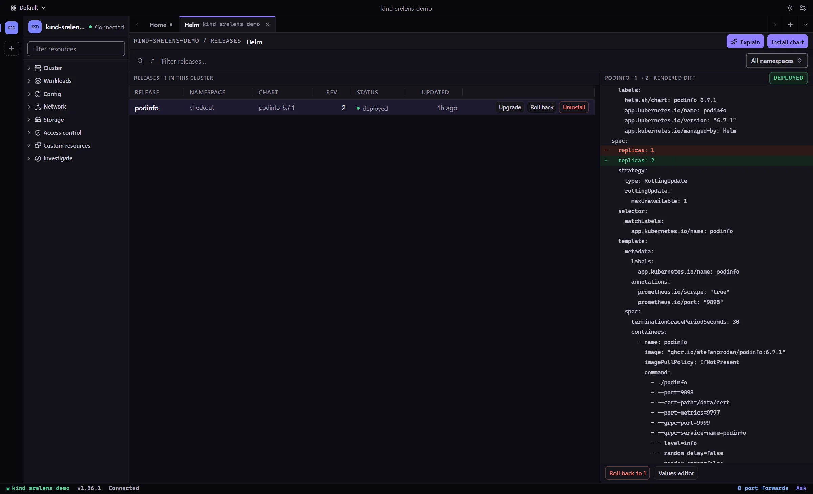<br><sub><b>Helm</b> – installieren, upgraden, zurückrollen und deinstallieren, mit gerendertem Diff</sub></td>
  </tr>
</table>

Was du damit machen kannst – das [Benutzerhandbuch](../USAGE.md) behandelt jeden Punkt ausführlich:

- **Multi-Cluster-Workspace** – kubeconfig-Kontexte erkennen, weitere Dateien
  hinzufügen oder einfügen, jedem Kontext einen Namen, ein Logo und eine Farbe geben
  und Cluster über die Cluster-Leiste wechseln. Kontexte, die in verschiedenen
  Dateien denselben Namen tragen, bleiben voneinander getrennt.
- **Live-Kubernetes-Ressourcen** – Workloads, Networking, Storage, RBAC, Admission,
  Autoscaling und Custom Resources, mit Live-Watches, Suche, Spaltenauswahl,
  Namespace-Eingrenzung und Massenaktionen.
- **Ressourcendetails und YAML** – Manifeste, Events, Beziehungen und Metriken;
  schemabewusstes YAML mit Validierung, Dry-Run-Diffs und Server-Side Apply.
- **Logs** – Streams für Pods oder Workloads mit Logs der vorherigen Instanz,
  Zeitstempeln, Einstellungen für Tail und Since-Zeitfenster, Farben pro Quelle,
  Container-Filtern und Export.
- **Terminals und Shells** – Pod-Exec, ein auf den Kontext bezogenes lokales Terminal,
  ephemere Debug-Container für Distroless-Pods und privilegierte Node-Shells.
- **Port-Forwarding** – Forwards über alle geöffneten Cluster hinweg anlegen,
  einsehen, kopieren und beenden.
- **Helm** – Releases einsehen sowie installieren, upgraden, zurückrollen oder
  deinstallieren, mit Values-Editor und Vorschau des gerenderten Diffs.
- **Betriebsaktionen** – skalieren, Rollouts neu starten, Pods evicten oder löschen,
  CronJobs aussetzen oder auslösen, Nodes cordonen und drainen, alles hinter
  Bestätigungsabfragen.
- **Toolbox** – `kubectl`, `krew`, `helm` und krew-Plugins installieren und verwalten
  sowie die Exec-Auth-Anforderungen eines Kontexts diagnostizieren.
- **Metriken** – CPU und Arbeitsspeicher von Nodes und Pods, sofern `metrics-server`
  verfügbar ist.
- **KI-Assistent** – Fragen zum Cluster vor dir stellen, einen Log-Stream
  zusammenfassen oder einen Helm-Diff erklären lassen.
- **Befehlspalette** – tastaturorientierte Navigation (Cmd/Ctrl-K) über Ansichten,
  Kontexte und Ressourcen.
- **Web-Modus** – dieselbe App als Mehrbenutzer-Webserver in Docker betreiben, mit
  OIDC-Anmeldung und Isolierung pro Benutzer. Siehe [docs/WEB.md](../WEB.md).

## Terminal-UI (`srectl`)

`srectl` ist srelens in deinem Terminal: ein einziges Binary, Navigation im
k9s-Stil und derselbe Rust-Kern wie in der Desktop-App. Es ist über SSH, auf
einem Jump-Host und überall dort zu Hause, wo es kein Fenster gibt.

<p align="center">
  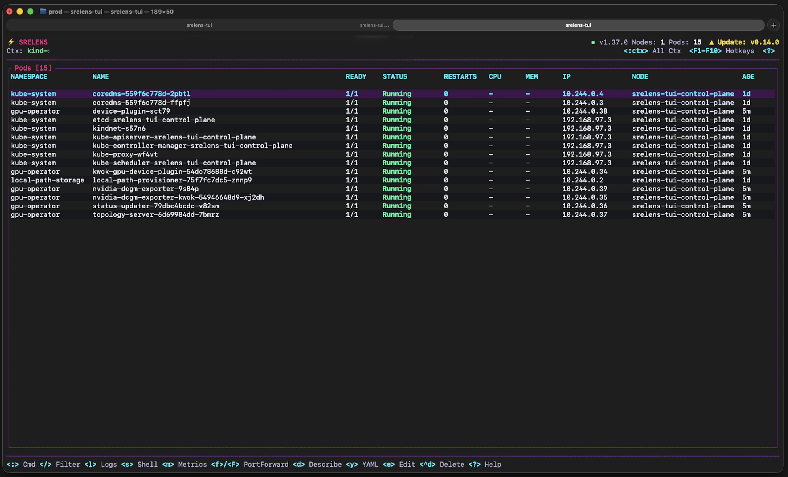
</p>

<table>
  <tr>
    <td width="50%">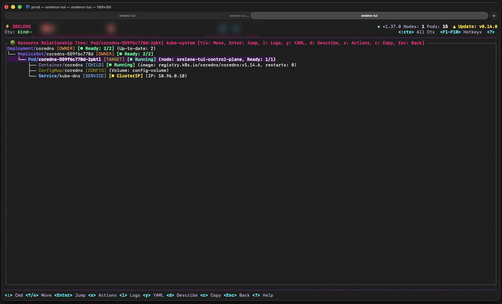<br><sub><b>Beziehungsbaum</b> – Owner, Kind-Ressourcen, Konfiguration und Services in einer Ansicht</sub></td>
    <td width="50%">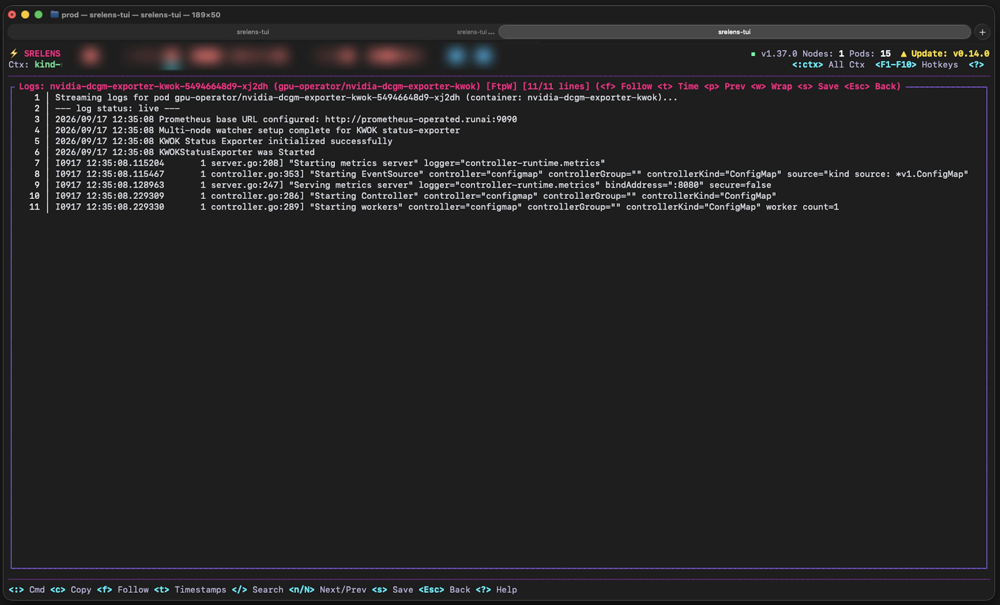<br><sub><b>Logs</b> – Follow-Modus, Suche, Zeitstempel, vorherige Instanz und Speichern</sub></td>
  </tr>
  <tr>
    <td>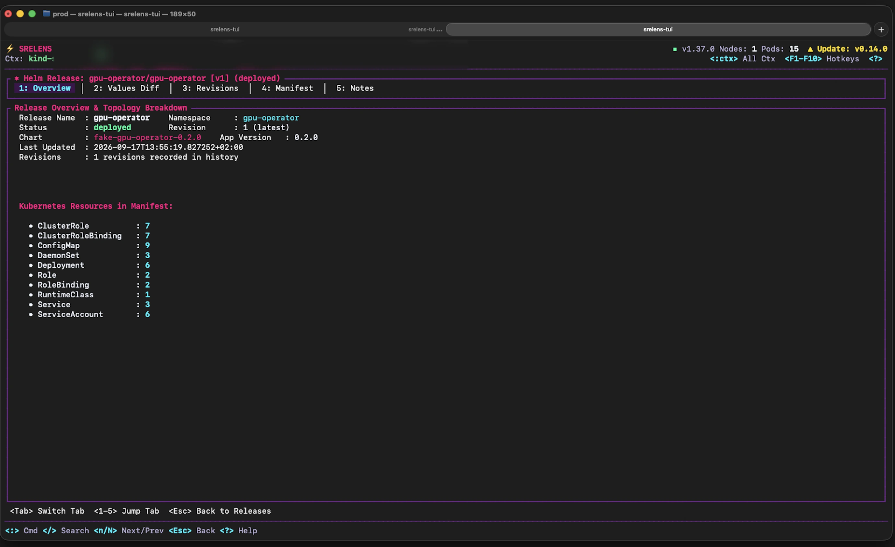<br><sub><b>Helm</b> – Revisionen, Values-Diff, Manifest und Rollback</sub></td>
    <td>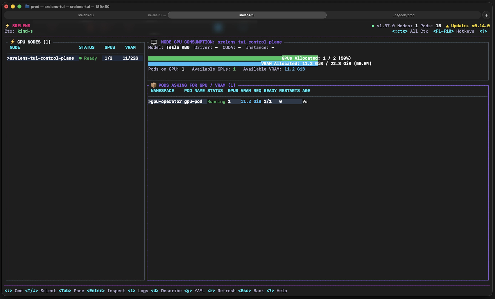<br><sub><b>GPU-Inspektor</b> – GPU- und VRAM-Zuteilung pro Node und pro Pod</sub></td>
  </tr>
  <tr>
    <td>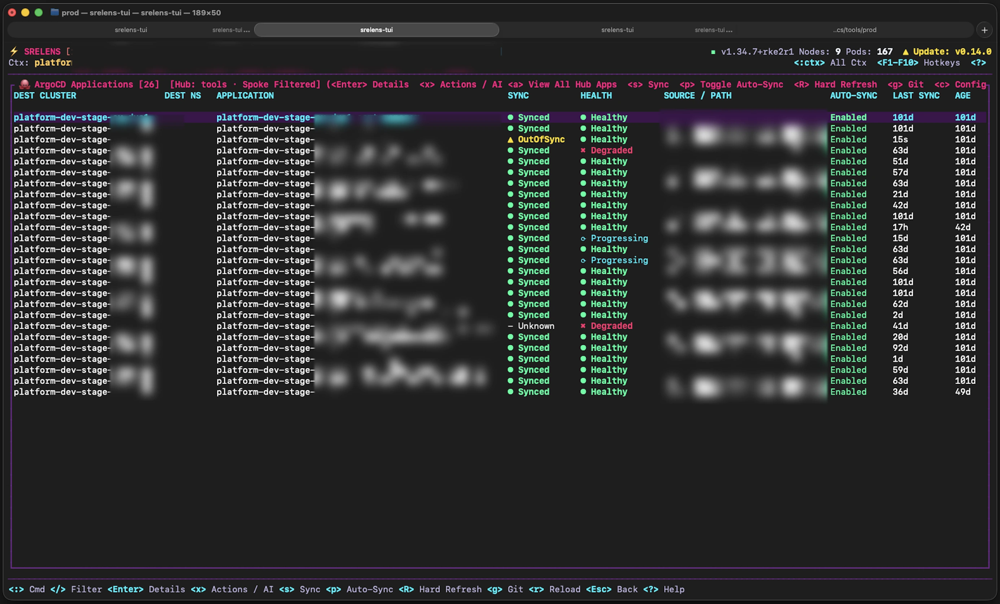<br><sub><b>Argo CD</b> – Sync, Health und Drift über Hub- und Spoke-Cluster hinweg</sub></td>
    <td>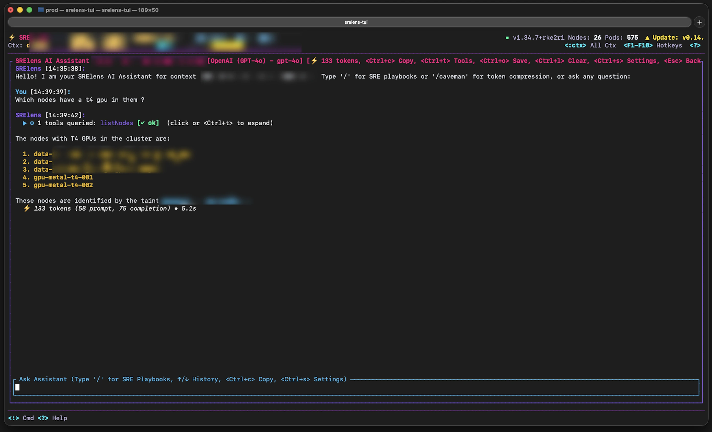<br><sub><b>KI-Assistent</b> – befragt den Cluster über Tools, mit SRE-Playbooks</sub></td>
  </tr>
</table>

- **Navigation im k9s-Stil** – `:` öffnet die Befehlszeile (`:pod`, `:deploy`,
  `:svc`, `:no`, `:ns`, `:helm`, `:pf`, `:ctx` …), `/` filtert, `j`/`k` bewegen den
  Cursor, `Enter` öffnet die nächste Ebene und `Esc` geht zurück.
- **Direkt auf das reagieren, was du siehst** – Logs (`l`), Shell (`s`), Describe (`d`),
  YAML (`y`), Bearbeiten (`e`), Port-Forward (`f`), Löschen (`Ctrl-d`) und eine
  Palette mit Schnellaktionen (`x`) für Neustart, Skalieren und mehr.
- **Untersuchen** – Beziehungsbaum (`t`), `:top`-Hotspots nach CPU und
  Arbeitsspeicher, `:topo`-Topologie, eine Cluster-Übersicht und Node-SSH zur
  Wiederherstellung.
- **Über die Grundlagen hinaus** – Ansichten für Argo CD (`:argo`), GPU und VRAM
  (`:gpuinfo`) sowie BGP-Peering (`:bgp`).
- **KI-Assistent** – `:ai` mit Anthropic (Claude), OpenAI, Google Gemini, jedem
  OpenAI-kompatiblen Endpunkt wie Ollama oder mit Cursor Agent.
- **Headless-Helfer** – `srectl info` listet die Kontexte in deiner kubeconfig auf,
  `srectl toolbox` prüft, ob `kubectl`, `helm` und `krew` vorhanden sind, und
  `srectl mcp` startet den MCP-Server über stdio.
- **Signiertes Self-Update** – `srectl update` installiert ein Release nur dann, wenn
  dessen Prüfsummen mit einem im Binary eingebauten srelens-Release-Schlüssel
  signiert sind.

```bash
srectl                      # startet im aktuellen Kontext
srectl -n payments          # startet in der Pod-Ansicht, auf einen Namespace beschränkt
srectl --context prod -A    # Kontext wählen, alle Namespaces
srectl pods/my-pod          # öffnet direkt eine bestimmte Ressource
srectl --help               # alle Flags
```

## Installation

Alle Releases findest du unter [GitHub Releases](https://github.com/srelens/srelens/releases/latest).
Die [Installationsanleitung](../INSTALL.md) beschreibt für jede Plattform den
ersten Start, Updates, das Verifizieren von Downloads und die Deinstallation.

### Desktop-App

| Plattform | Pakete | Hinweise |
| --- | --- | --- |
| macOS | `.dmg` für Apple Silicon und Intel | Mit Developer ID signiert und notarisiert |
| Linux | `.AppImage`, `.deb`, `.rpm` und [`srelens-bin`](https://aur.archlinux.org/packages/srelens-bin) im AUR | Das AppImage unterstützt den In-App-Updater |
| Windows | `.exe`, `.msi` | Windows zeigt möglicherweise eine SmartScreen-Warnung an, solange Code-Signing noch auf der Roadmap steht |

### Terminal-UI

macOS (Homebrew):

```bash
brew install srelens/tap/srectl
```

Linux, als Einzeiler:

```bash
( f="$(mktemp)" && trap 'rm -f "$f"' EXIT &&
  curl -fsSL https://raw.githubusercontent.com/srelens/srelens/main/packaging/install/install.sh -o "$f" &&
  sh "$f" )
```

Oder lade `srectl-<version>-<target>.tar.gz` (bzw. `.zip` unter Windows) aus dem
Release herunter – für Linux (glibc und statisches musl) und macOS auf x86-64 und
arm64 sowie für Windows auf x86-64. macOS-Builds eines Stable-Releases sind
signiert und notarisiert.

### Web-App (Docker)

srelens läuft auch als Mehrbenutzer-Webserver in einem Container. Benutzer melden
sich per OIDC an (oder zum Ausprobieren mit einem lokalen Dev-Login), und jeder
bekommt eine isolierte Umgebung, die ausschließlich aus den eigenen hochgeladenen
kubeconfigs aufgebaut wird. Bei OIDC-geschützten Clustern erfolgt die Anmeldung im
Browser, ganz ohne `kubelogin` oder Exec-Plugin, und kubeconfigs sowie Tokens
werden im Ruhezustand (at rest) mit einem zwingend erforderlichen
`SRELENS_MASTER_KEY` versiegelt. Deployment und das vollständige Sicherheitsmodell
beschreibt [docs/WEB.md](../WEB.md).

## MCP-Server

srelens enthält einen MCP-Server, der aus derselben Capability-Registry generiert
wird wie das Backend. MCP-fähige Clients erhalten so dieselben Cluster-Operationen
ohne separate Integrationsschicht.

Öffne in der Desktop-App **Settings → MCP** (Einstellungen → MCP), um:

- den Server über Loopback-HTTP zu betreiben, geschützt durch ein Bearer-Token, das
  du anzeigen, rotieren oder widerrufen kannst – beim Rotieren wird der laufende
  Server neu gestartet, damit das neue Token sofort gilt, und beim Widerrufen wird
  er gestoppt;
- die `srelens`-CLI für stdio-Verbindungen zu installieren, die kein Token brauchen,
  weil der Client, der den Prozess startet, ohnehin schon mit deinen Rechten läuft;
- die Client-Konfiguration für unterstützte MCP-Clients zu kopieren.

Oder starte ihn direkt – aus dem Desktop-Binary oder aus der Terminal-UI:

```sh
srelens --mcp-stdio
srelens --mcp-http 127.0.0.1:8765
srectl mcp
```

Beispielkonfiguration für stdio:

```json
{
  "mcpServers": {
    "srelens": {
      "command": "srelens",
      "args": ["--mcp-stdio"]
    }
  }
}
```

Destruktive Tools fragen in der App nach einer Bestätigung. Headless-Läufe können
keinen Dialog anzeigen; sie brauchen daher `"_confirm": true` im Aufruf *und* ein
Opt-in auf Prozessebene: `--mcp-allow-destructive`, um überhaupt etwas zu ändern,
oder `--mcp-allow-sensitive-reads`, um Secrets zu lesen (`--allow-destructive` und
`--allow-sensitive-reads` bei `srectl mcp`). Beide sind voneinander unabhängig: Die
Berechtigung, ein Secret zu lesen, schließt nie die Berechtigung ein, einen Node zu
drainen. Das vollständige Sicherheitsmodell, einschließlich Host-Header-Prüfung,
Audit-Log und Token-Speicherung, beschreibt [docs/MCP.md](../MCP.md).

> Der MCP-Zugriff nutzt deine lokal authentifizierten Cluster-Kontexte. Prüfe
> Tool-Aufrufe und setze passende Kubernetes-RBAC-Berechtigungen ein, besonders bei
> kritischen Clustern.

## Aus dem Quellcode bauen

### Voraussetzungen

- [Rust](https://rustup.rs) (stable)
- [Node.js](https://nodejs.org) 26 (Standard für die Entwicklung; Node 24 LTS wird ebenfalls unterstützt). Führe `nvm install && nvm use` aus, um die Version aus `.nvmrc` zu verwenden.
- [pnpm](https://pnpm.io) 9+
- [Systemabhängigkeiten für Tauri v2](https://v2.tauri.app/start/prerequisites/)
- Ein erreichbarer Kubernetes-Cluster für Workflows, die einen Cluster voraussetzen

### Lokal ausführen

```sh
git clone https://github.com/srelens/srelens
cd srelens
pnpm install
pnpm dev                  # the desktop app
cargo run -p srectl       # the terminal UI
```

### Nützliche Befehle

| Befehl | Zweck |
| --- | --- |
| `pnpm dev` | Startet die Desktop-Anwendung im Entwicklungsmodus |
| `cargo run -p srectl` | Startet die Terminal-UI |
| `pnpm test` | Führt die JavaScript- und TypeScript-Tests aus |
| `cargo test` | Führt die Tests des Rust-Workspace aus |
| `pnpm build` | Baut das Produktions-Frontend |
| `pnpm tauri build` | Erstellt paketierte Desktop-Binaries |

Architektur, Teststandards und wie du eine Capability hinzufügst, beschreibt das
[Entwicklerhandbuch](../DEVELOPMENT.md).

## Architektur

```text
 Desktop app (React 19 + Tauri v2)   Terminal UI (srectl)   MCP clients   Web app
                 │                           │                  │            │
                 └───────────────┬───────────┴──────────────────┴────────────┘
                                 ▼
                         Pure-Rust core
                         ├── capability registry
                         ├── Kubernetes integration with kube-rs
                         ├── live watches, logs, exec and port forwarding
                         ├── Helm and metrics
                         └── MCP server over stdio and loopback HTTP
```

Aufbau des Repositorys:

```text
apps/
  desktop/               Tauri desktop app: React UI (src/) and Rust bridge (src-tauri/)
  tui/                   srectl, the terminal UI
packages/
  core/                  Shared frontend service layer
  ui-kit/                Design-system components
  ui-next/               The new desktop design
crates/
  capability/            Backend capability registry
  kube/                  Kubernetes clients, watches, actions, Helm and metrics
  mcp/                   MCP server
  registry/              Where every backend capability is registered
  server/                Web mode server
  streams/               Streaming cores shared by desktop and web
  agent/, llm/           AI assistant and agent-CLI bridge
  plugin-host/           Extension host
docs/                    Installation, usage, development and project documentation
```

## Projektstatus

srelens ist **stabil und in aktiver Entwicklung**, mit regelmäßigen Releases für
macOS, Linux und Windows. macOS-Builds sind mit Developer ID signiert und
notarisiert, und unterstützte Pakete werden direkt an Ort und Stelle aktualisiert.
Neue Funktionen kommen laufend hinzu – ein Blick in die Release Notes lohnt sich
also bei jedem Upgrade.

- [Neuestes Release](https://github.com/srelens/srelens/releases/latest)
- [Alle Releases](https://github.com/srelens/srelens/releases)
- [Issues und Roadmap](https://github.com/srelens/srelens/issues)

## Community

- [r/srelens auf Reddit](https://www.reddit.com/r/srelens/) – Ankündigungen,
  Fragen und Feedback
- [Issues](https://github.com/srelens/srelens/issues) – Bugs und Feature-Requests
- [Website](https://srelens.com)

## Mitwirken

Beiträge sind willkommen. Fang am besten mit dem [Leitfaden für Beiträge](../../CONTRIBUTING.md),
dem [Entwicklerhandbuch](../DEVELOPMENT.md), dem
[Leitfaden zur MCP-Agent-Integration](../MCP.md) und den
[offenen Issues](https://github.com/srelens/srelens/issues) an. Bitte lies den
[Verhaltenskodex (Code of Conduct)](../../.github/CODE_OF_CONDUCT.md), bevor du dich beteiligst.

Die Übersetzungen liegen in [`docs/i18n`](.). Maßgeblich ist die englische
README; Korrekturen an einer Übersetzung oder eine neue Sprache sind als
Pull Request willkommen.

## Lizenz

srelens ist Open Source unter der [MIT-Lizenz](../../LICENSE).

---

<p align="center">
  <sub>Keine Verbindung zu Mirantis Lens oder dem Freelens-Projekt.</sub>
</p>
